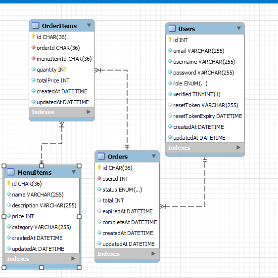
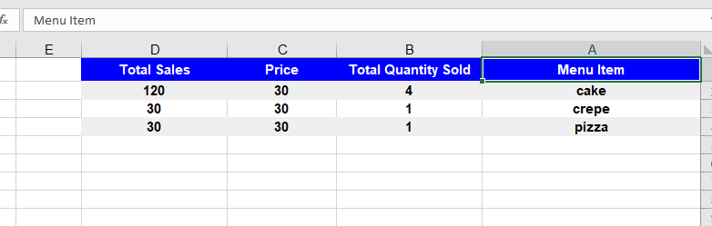
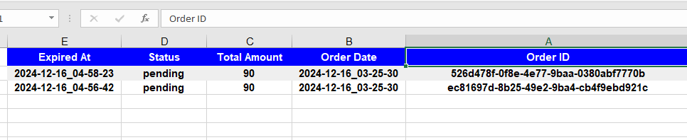

# Simplified Restaurant Management System

## Table of Contents
- [Overview](#overview)
- [Technologies](#technologies)
- [Installation](#installation)
- [Environment Variables](#environment-variables)
- [Database Schema](#database-schema)
- [API Routes](#api-routes)
- [Testing](#testing)
- [Deployment](#deployment)
- [Postman Collection](#postman-collection)
- [Swagger Documentation](#swagger-documentation)
- [ERD (Entity Relationship Diagram)](#erd)
- [Bonus Features](#bonus-features)

---

## Overview
This project implements a **Simplified Restaurant Management System** API with order and menu management. and role-based user authentication. The system focuses on performance and security, ensuring efficient operations and secure API interactions.

---

## Technologies
- **Backend**: Node.js, Express.js
- **Database**: MySQL (with Sequelize ORM)
- **API Documentation**: Swagger/OpenAPI, Postman
- **Security**: JWT for authentication, Input validation 
- **Testing**: Jest
- **Deployment**: Deployed via [Your Hosting Platform]

---

## Installation
Follow these steps to set up the project locally:

1. **Clone the repository**:  
   ```bash
   git clone https://github.com/nadaaboelkheir/Restaurant-Management-System
   cd restaurant-management-system
   ```

2. **Install dependencies**:  
   ```bash
   npm install
   ```


3. **Run the application**:  
   Start the server:
   ```bash
   npm run dev
   ```

---

## Environment Variables
Create a `.env` file in the root directory with the following:
```env
DB_USERNAME=root
DB_DATABASE=railway
DB_PASSWORD=
DB_HOST=
DB_PORT=

PORT=8080
NODE_ENV=development
JWT_SECRET=
EMAIL_USER=
EMAIL_PASS=
EMAIL_HOST=
EMAIL_PORT=
```

---

## Database Schema
1. **Users Table**: Stores user details like `id`, `name`, `email`, `password`, and `role` (admin/staff), identifying who interacts with the system.  
2. **Orders Table**: Tracks orders with `id`, `userId` (linked to Users), and `status` (e.g., pending, completed, expired).  
3. **OrderItems Table**: Represents items in an order with `id`, `orderId` (linked to Orders), `menuItemId` (linked to MenuItems), and `quantity`.  
4. **MenuItems Table**: Contains menu details like `id`, `name`, `description`, `price`, and `category`, defining available food items.  

---

## API Routes
### **Menu Management** (Admins Only)
- `POST /api/v1/menueItem` - Create a menue item (Admin only)
- `GET /api/v1/menueItem` - Get all menue items with optional filters (category, price sorting) (Staff - admin)
- `GET /api/v1/menueItem/:id` - Get a specific menue item (Staff - admin)
- `PUT /api/v1/menueItem/:id` - Update a menue item (Admin only)
- `DELETE /api/v1/menueItem/:id` - Delete a menu item(Admin only)

### **Order Management**
- `POST /api/v1/order` - Create a new order (Staff only)
- `PUT /api/v1/order/:id` - Add an item to an order (Staff only)
- `Delete /api/v1/order/:id` - Remove an item from an order (Staff only)
- `PUT /api/v1/order/:id` - Mark order as complete (Staff only)
- `GET /api/v1/order` - Get all orders (Admin only)
- `GET /api/v1/order/:id` - Get details of a specific order (Admin only)

### **Authentication**
- `POST /api/v1/auth/signup` - Register a user
- `POST /api/v1/auth/login` - Authenticate a user and generate JWT
- Admin Created if Not Exist 
---

## Testing
Run the following command to execute tests:
```bash
npm run test
```
---

## Deployment
The application is deployed at:  
- **Backend**: [https://restaurant-management-system-production-5cea.up.railway.app/api/v1/](https://restaurant-management-system-production-5cea.up.railway.app/api/v1/)

---

## Postman Collection
Access the interactive API documentation via Postman:  
[https://documenter.getpostman.com/view/38529077/2sAYHzF2ca](https://documenter.getpostman.com/view/38529077/2sAYHzF2ca)

---

## Swagger Documentation
Explore the complete API documentation at:  
[http://localhost:8080/api-docs](http://localhost:8080/api-docs)

---

## ERD (Entity Relationship Diagram)
  
The ERD depicts the relationships between Users, MenuItems, and Orders.


## Bonus Features
1. **Top 10 Selling Items in Last 30 Days**:  
   Endpoint: `GET /api/menueItem/export-top-selling`

2. **Export Orders in CSV/XLSX**:  
   Endpoint: `GET /api/order/export`

3. **Rate Limiting**:  
   Applied to `POST /api/auth/login` to prevent brute-force attacks.

4. **Password Reset**:  
   Endpoint: `POST /api/auth/request-password-reset`
   Endpoint: `POST /api/auth/reset-password/:token`

---

## Additional 
- when export Orders In Excel or export top selling items remove auth middleware for testing it in web browser
  
  


